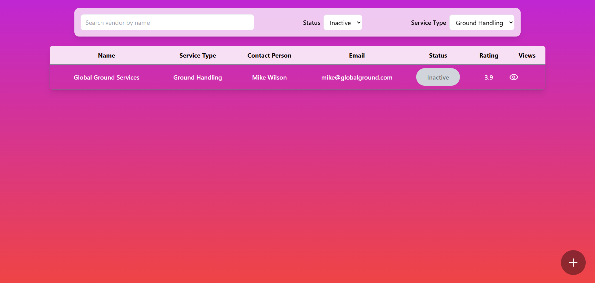
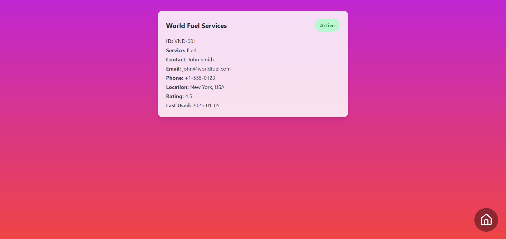
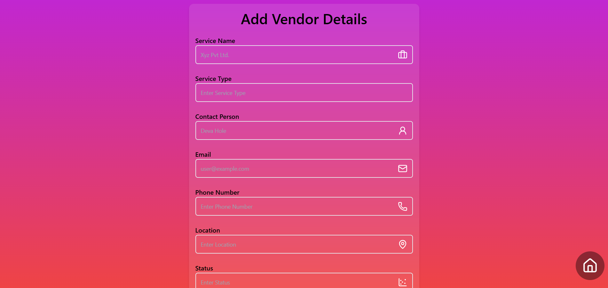
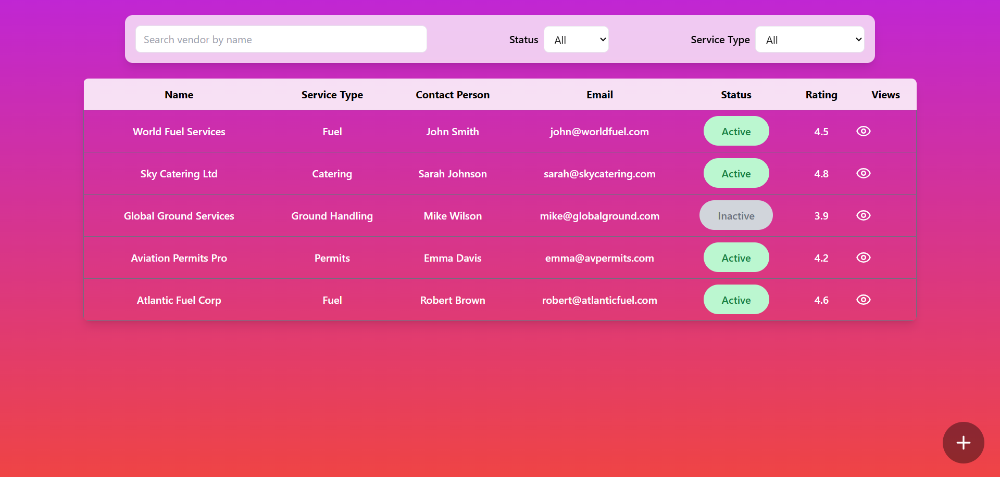

# Vendor Management System

A modern **Vendor Management System** built with **React**, **Tailwind CSS**, **React Hook Form**.  
This project allows users to **add, view, filter, and manage vendors** efficiently in a responsive dashboard interface.

---

## 📌 Features

- **Vendor CRUD Operations**:
  - Add new vendors with detailed information
  - View vendor list in a responsive table
  - Filter vendors by **status**, **service type**, and **name**
- **Form Validation**:
  - Real-time validation using **React Hook Form**
  - Validates emails, phone numbers, ratings
- **Responsive Design**:
  - Works perfectly on **mobile, tablet, and desktop**
  - Horizontal scroll for tables on smaller screens
- **Modern UI**:
  - Gradient backgrounds, shadows, glassmorphism effects
  - Icons using **Lucide React**
- **Reusable Components**:
  - Input fields, labels, buttons, filter bars, table rows

---

## 🛠️ Tech Stack

- **Frontend**:
  - React.js
  - Tailwind CSS
  - React Hook Form
  - Lucide React Icons

---

- **ScreenShots**:

---

---

---

